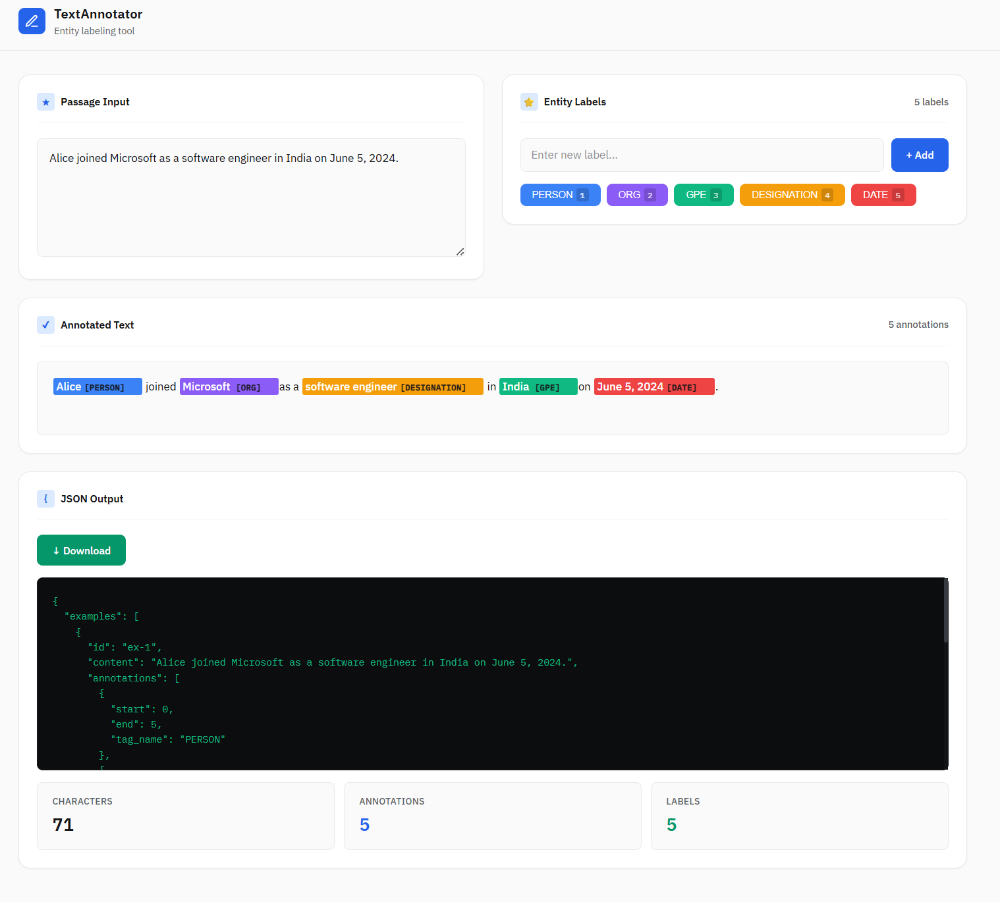

# TextAnnotator

A clean, professional NER (Named Entity Recognition) annotation tool for text labeling. Built with React.



## What is TextAnnotator?

TextAnnotator is a web-based tool for creating training data for NLP models. Select text in a passage and label it with entity tags like PERSON, ORG, or GPE to create annotated datasets that can be used to train NER models.

## Features

- **Text Input** - Paste or type any passage text
- **Entity Labels** - Create custom labels (PERSON, ORG, GPE, etc.)
- **Visual Annotation** - See highlighted entities in the text
- **JSON Export** - Download annotations as JSON for training data
- **Keyboard Shortcuts** - Press 1, 2, 3... to quickly apply labels
- **Professional UI** - Clean interface designed for productivity

## Getting Started

### Prerequisites

- Node.js 18+
- npm or yarn

### Installation

```bash
# Clone the repository
git clone https://github.com/your-username/textannotator.git
cd textannotator

# Install dependencies
npm install
```

### Development

```bash
# Start development server
npm run dev

# Or use the start script
npm start
```

The app will open at http://localhost:3001

### Production Build

```bash
npm run build
```

Builds the app for production to the `build` folder.

## How to Use

1. **Enter text** in the Passage Input box
2. **Select text** with your mouse/cursor
3. **Click a label** (or press 1, 2, 3) to annotate
4. **Download** the JSON output for training

### JSON Output Format

```json
{
  "examples": [
    {
      "id": "ex-1",
      "content": "John works at Google in New York.",
      "annotations": [
        { "start": 0, "end": 4, "tag_name": "PERSON" },
        { "start": 14, "end": 20, "tag_name": "ORG" },
        { "start": 24, "end": 32, "tag_name": "GPE" }
      ]
    }
  ]
}
```

- `start` / `end` - Character positions in the text
- `tag_name` - The entity label applied